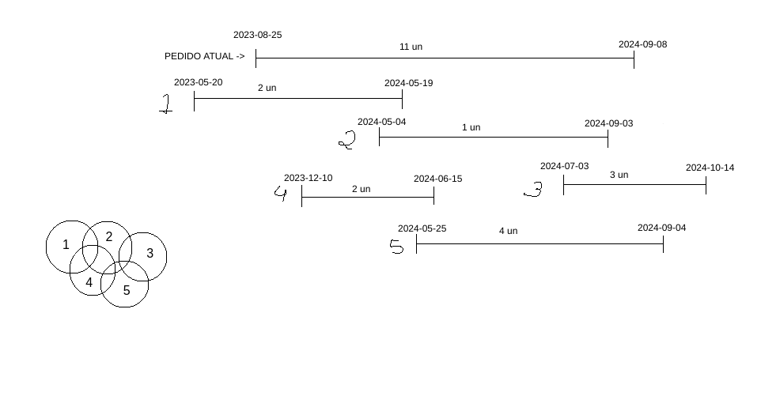

# Recursive-CTE-MYSQL

## Intersection of sets.

### Query to list items and its available quantity to create an order.

Items are unavailable when they are addressed by some order. Orders are created with a period of use. If multiples orders cross it's periods, and they share same items, the unavailable item's quantity will be added together. The largest sum of the intersections should be considered the unavailable quantity of the item for creating a new order.

The image below shows an example of sets and periods.

The total number of items is 11 and the number of unavailable items is 8, represented by the intersection between the sets 2-3-5.

